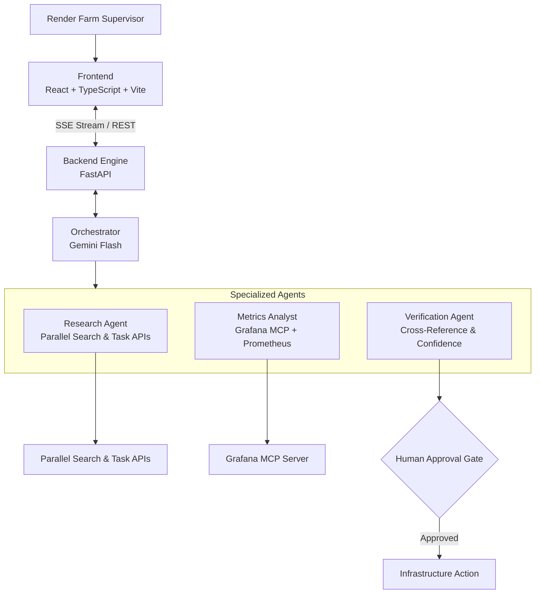

# Render Farm Incident Copilot

> **Agentic Cinema: The Blockbuster Hackathon** — *Google Cloud × Devpost*  
> Partner Track: **Parallel** | Integration: **Grafana MCP**

[](LICENSE)


**The Problem**: A VFX render farm supervisor gets a Grafana alert — GPU utilization spiked to 94% on render-node-07, 847 frames are backlogged. Today they spend 30–60 minutes manually searching bug trackers, vendor patch notes, and Slack channels to figure out if it's a known Arnold renderer issue or a hardware failure, before deciding whether to scale the cluster at $2,400/hr.

**The Copilot**: Render Farm Incident Copilot automates that investigation in 90 seconds. An **Orchestrator Agent** (Gemini Flash) decomposes the incident into an investigation plan. A **Research Agent** searches for known issues via Parallel Search & Task APIs. A **Metrics Analyst** pulls live telemetry from Grafana MCP. A **Verification Agent** cross-references all evidence. The system pauses at a **Human Approval Gate** before executing any infrastructure changes.

---

## Architecture



---

## Partner Track: Parallel

| API | Usage | Role |
|---|---|---|
| **Search API** (`parallel_web_search`) | Search for known bugs, vendor advisories, community-reported issues | Primary investigation source |
| **Task API** (`parallel_deep_research`) | Multi-hop deep research with trust-scored citations | Root cause synthesis |

Both APIs fire on every mission run. Only successful live responses are treated as evidence; unavailable integrations are surfaced in the activity log and prevent an infrastructure recommendation.

## Integration: Grafana MCP

- **Protocol**: Official `mcp` Python SDK via stdio transport to the official `grafana/mcp-grafana` Docker server
- **Tools**: `search_dashboards`, `list_datasources`, `query_prometheus`, `alerting_manage_rules`, `query_loki_logs`
- **Auth**: Grafana Cloud or Grafana OSS service-account token (unattended execution)
- **Evidence integrity**: Grafana MCP errors are surfaced as unavailable; the app never substitutes fabricated telemetry or citations.

## Core AI: Google Cloud

- **Engine**: Gemini Flash via `google-genai` (`gemini-flash-latest`) — 100% Google Cloud AI at runtime
- **Usage**: Orchestrator planning, agent reasoning, evidence synthesis, cross-verification

---

## Quick Start

### Backend
```bash
pip install -r requirements.txt
cp .env.example .env  # Configure API keys
uvicorn backend.main:app --port 8000
```

### Frontend
```bash
cd frontend && npm install && npm run dev
```

Open **http://localhost:5173/**

### Environment Variables
```env
GEMINI_API_KEY=your_gemini_api_key
PARALLEL_API_KEY=your_parallel_api_key
GRAFANA_URL=http://localhost:3000
GRAFANA_SERVICE_ACCOUNT_TOKEN=your_token
GEMINI_MODEL=gemini-flash-latest
```

For Grafana Cloud, set `GRAFANA_URL` to your stack URL, for example `https://your-stack.grafana.net`. When using the Docker MCP server, `localhost` refers to the container; use `http://host.docker.internal:3000` for a local Grafana instance instead.

---

## License

MIT License — see [LICENSE](LICENSE).
## Live Grafana demo telemetry

The render-farm values shown by the demo can be generated by a local, instrumented simulator and stored in Grafana Cloud as real Prometheus samples. They are clearly demo telemetry; the application never presents local values as a Grafana MCP result.

1. Add `GRAFANA_PROMETHEUS_REMOTE_WRITE_URL`, `GRAFANA_PROMETHEUS_USERNAME`, and `GRAFANA_PROMETHEUS_TOKEN` to `.env`.
2. Start the backend on port 8000 so its `/metrics` endpoint is available.
3. With Docker Desktop running, execute `./monitoring/start-telemetry.ps1`.
4. Create a Grafana-managed alert rule against `render_queue_depth_frames{cluster="cluster-b"} > 800` and wait for it to fire.
5. Run a mission. The official Grafana MCP server queries the stored samples and firing alert before the approval gate can appear.
